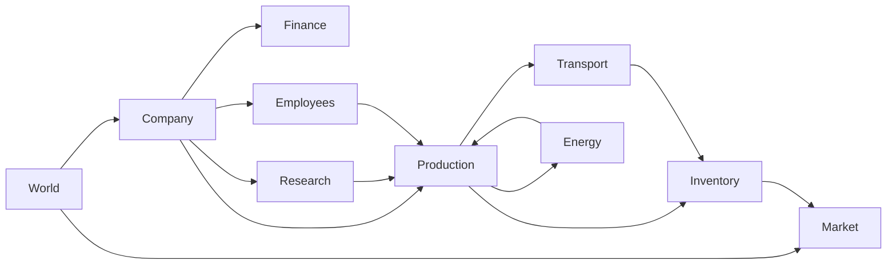
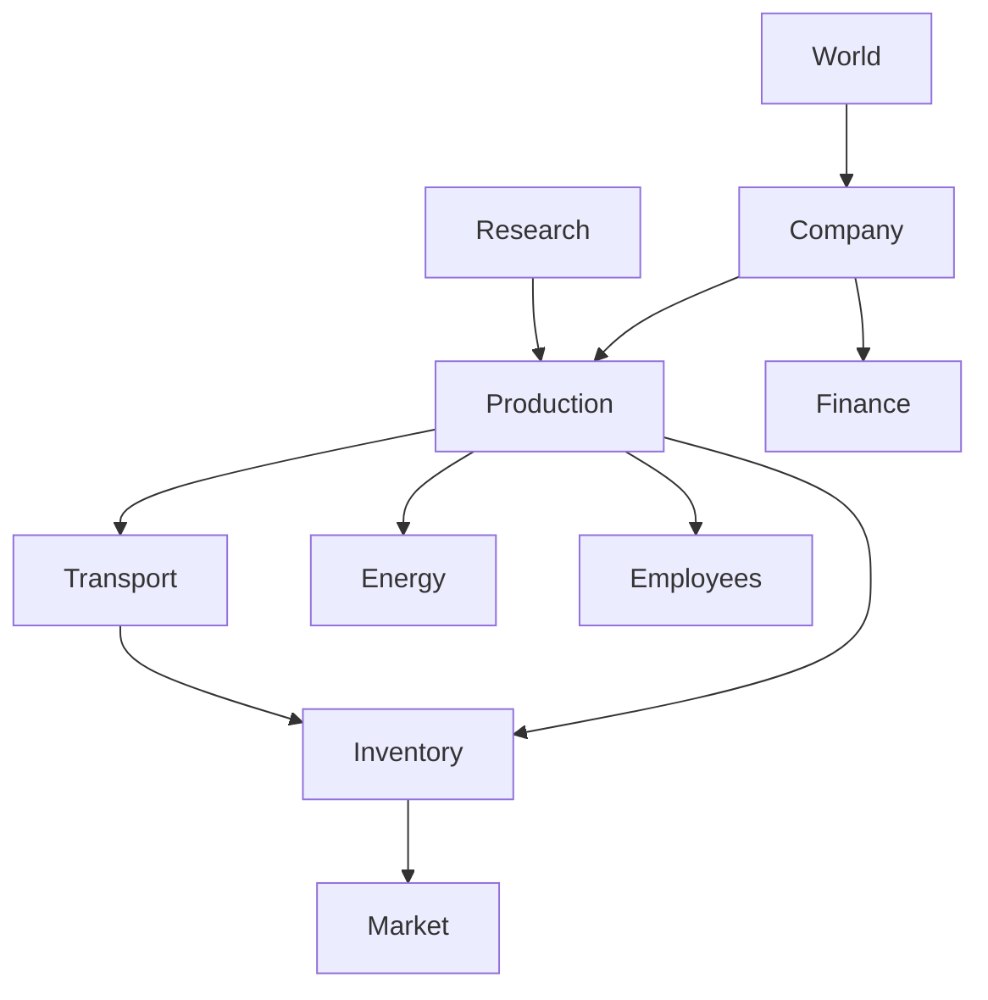

# Bounded Contexts

Version: 1.0.0

Status: Draft

---

# Zweck

Dieses Dokument beschreibt die fachliche Aufteilung von **Project Genesis** in Bounded Contexts gemäß den Prinzipien des Domain-Driven Design (DDD).

Ein Bounded Context kapselt einen klar abgegrenzten fachlichen Verantwortungsbereich. Jeder Kontext besitzt sein eigenes Modell, seine eigenen Aggregate und seine eigene Geschäftslogik.

Die Trennung dient dazu, Kopplung zu reduzieren und die langfristige Wartbarkeit der Simulation sicherzustellen.

---

# Architekturprinzipien

Für alle Bounded Contexts gelten folgende Regeln:

- Jeder Kontext besitzt eine klar definierte Verantwortung.
- Geschäftslogik bleibt innerhalb ihres Kontexts.
- Kommunikation erfolgt ausschließlich über definierte Schnittstellen oder Domain Events.
- Aggregate werden niemals direkt von anderen Kontexten verändert.
- Referenzen auf fremde Aggregate erfolgen ausschließlich über IDs.

---

# Context Map



---

# Überblick

| Context | Verantwortung |
|----------|---------------|
| World | Welt, Regionen, Simulationszeit |
| Company | Unternehmen und Unternehmensentwicklung |
| Production | Produktionsplanung und Fertigung |
| Inventory | Lager und Ressourcenbestände |
| Market | Angebot, Nachfrage und Preise |
| Finance | Buchhaltung und Geldflüsse |
| Research | Technologien und Freischaltungen |
| Transport | Logistik und Warenbewegung |
| Energy | Energieversorgung |
| Employees | Mitarbeitende und Arbeitskraft |

---

# World Context

## Verantwortung

- Welt
- Regionen
- globale Parameter
- Simulationszeit
- globale Ereignisse

## Aggregate

- World
- Region

## Liefert

- Regionen
- Weltparameter
- Zeitinformationen

---

# Company Context

## Verantwortung

Unternehmen als wirtschaftliche Einheit.

## Aggregate

- Company

## Verwaltet

- Unternehmensdaten
- Besitz
- Expansion
- Unternehmensstatus

## Nutzt

- Finance
- Employees
- Production
- Research

---

# Production Context

## Verantwortung

Alle Produktionsprozesse.

## Aggregate

- Building
- ProductionJob

## Verantwortlich für

- Produktionsplanung
- Rezeptausführung
- Produktionsfortschritt

## Nutzt

- Inventory
- Energy
- Employees

---

# Inventory Context

## Verantwortung

Alle Ressourcenbestände.

## Aggregate

- Inventory

## Verantwortlich für

- Lager
- Ein- und Auslagerung
- Reservierungen

---

# Market Context

## Verantwortung

Marktwirtschaft.

## Aggregate

- Market

## Verantwortlich für

- Angebot
- Nachfrage
- Preisbildung
- Handelsvolumen

Der Market besitzt keine Produktionslogik.

---

# Finance Context

## Verantwortung

Finanzsystem.

## Aggregate

- FinanceAccount

## Verantwortlich für

- Kontostände
- Einnahmen
- Ausgaben
- Investitionen

---

# Research Context

## Verantwortung

Technologieentwicklung.

## Aggregate

- ResearchProject

## Verantwortlich für

- Forschung
- Freischaltungen
- Technologiebaum

---

# Energy Context

## Verantwortung

Energieversorgung.

## Aggregate

- EnergyNetwork

## Verantwortlich für

- Energieproduktion
- Energieverteilung
- Energieverbrauch

---

# Employees Context

## Verantwortung

Simulation aller Mitarbeitenden.

## Aggregate

- Employee

## Verantwortlich für

- Einstellung
- Qualifikation
- Arbeitskraft
- Produktivität

---

# Transport Context

## Verantwortung

Logistik.

## Aggregate

- TransportRoute
- TransportJob

## Verantwortlich für

- Warenbewegung
- Transportplanung
- Lieferzeiten

---

# Context-Abhängigkeiten



Die Pfeile beschreiben fachliche Abhängigkeiten, nicht Implementierungsdetails.

---

# Domain Events

Kontexte kommunizieren bevorzugt über Domain Events.

Beispiele:

- ProductionCompleted
- InventoryChanged
- MarketPriceChanged
- ResearchCompleted
- CompanyExpanded
- EmployeeHired
- EnergyShortage
- TransportArrived

Kein Kontext verändert fremde Aggregate direkt.

---

# Besitzverhältnisse

```text
World
 └── Region

Company
 ├── Buildings
 ├── Employees
 ├── Finance
 └── Research

Building
 └── Inventory

Transport
 └── TransportJobs
```

Die Besitzverhältnisse definieren Aggregate und Konsistenzgrenzen.

---

# Schichten

```text
Application

↓

Domain

↓

Infrastructure
```

Alle Bounded Contexts befinden sich vollständig innerhalb der Domain-Schicht.

---

# Umsetzung im Quellcode

```text
src/

domain/

world/
company/
production/
inventory/
market/
finance/
research/
energy/
employees/
transport/

common/
events/
```

Jeder Kontext besitzt:

- Entities
- Value Objects
- Aggregate
- Domain Services
- Domain Events
- Repositories (Interfaces)

---

# Integrationsregeln

- Keine zyklischen Abhängigkeiten.
- Kommunikation über IDs oder Events.
- Keine direkten Objektgraphen zwischen Kontexten.
- Jeder Kontext bleibt unabhängig testbar.

---

# Qualitätsziele

Diese Struktur unterstützt:

- geringe Kopplung
- hohe Kohäsion
- Testbarkeit
- Erweiterbarkeit
- Modding
- Determinismus
- klare Verantwortlichkeiten

---

# Referenzen

- SAD.md
- DDD.md
- domain-model.md
- DD-003 – Global Identifiers
- DD-009 – Deterministic Simulation
- DD-027 – Event-Driven Simulation Architecture
- DD-028 – CQRS Lite