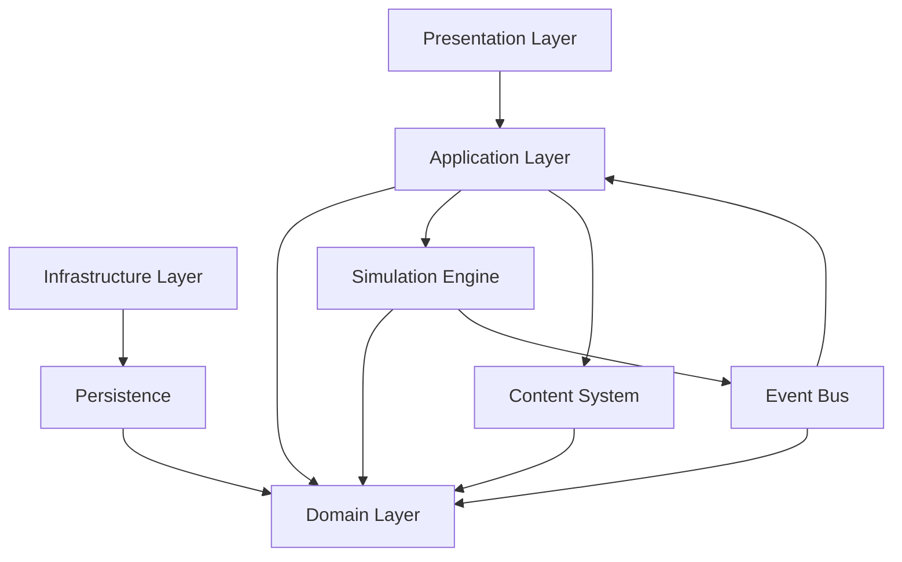
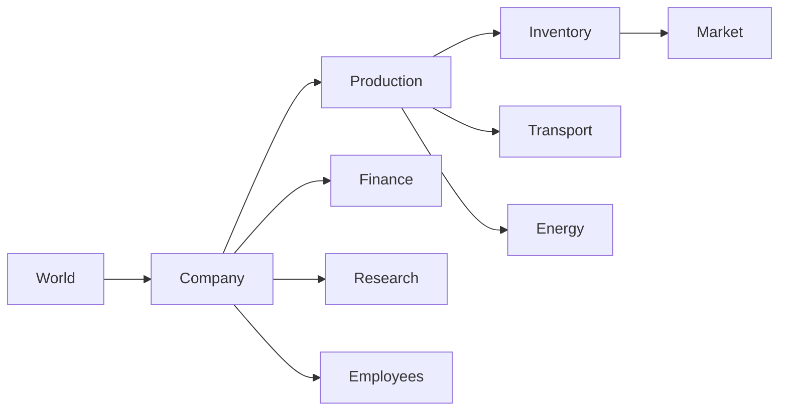
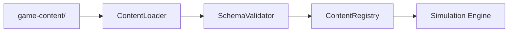

# Component Diagram

Version: 1.0.0

Status: Draft

---

# Zweck

Dieses Dokument beschreibt die technische Komponentenarchitektur von **Project Genesis**.

Es zeigt die wichtigsten Softwarekomponenten, ihre Verantwortlichkeiten und ihre Abhängigkeiten.

Die Architektur folgt den Prinzipien von:

- Domain-Driven Design (DDD)
- Clean Architecture
- CQRS Lite
- Event-Driven Architecture

---

# Architekturübersicht



---

# Layer Architecture

```text
Presentation
        │
        ▼
Application
        │
        ▼
Domain
        │
        ▼
Infrastructure
```

Die Abhängigkeiten verlaufen ausschließlich von oben nach unten.

Die Domain besitzt keinerlei Abhängigkeiten auf UI oder Infrastruktur.

---

# Komponenten

## Presentation Layer

### Verantwortung

- Benutzeroberfläche
- Eingabeverarbeitung
- Visualisierung
- HUD

Beispiel:

```text
src/ui/
```

---

## Application Layer

### Verantwortung

Koordination aller Anwendungsfälle.

Sie enthält keine Geschäftslogik.

Beispiele:

- BuildBuilding
- StartResearch
- CreateTransport
- ExecuteTick

---

## Domain Layer

Die Domain bildet den fachlichen Kern des Spiels.

Sie enthält:

- Aggregate
- Entities
- Value Objects
- Domain Services
- Domain Events

Die Domain kennt weder Rendering noch Persistenz.

---

## Simulation Engine

Die Simulation Engine steuert den gesamten Simulationsablauf.

Verantwortlich für:

- Tick Scheduling
- Systemreihenfolge
- Determinismus
- Event-Verarbeitung

---

## Content System

Verantwortlich für:

- Laden der YAML-Dateien
- Schema-Validierung
- Registrierung
- Mod-Integration

Bestandteile:

```text
ContentLoader

ContentRegistry

SchemaValidator

ModLoader
```

---

## Event Bus

Zentrale Kommunikation zwischen den Systemen.

Eigenschaften:

- synchron innerhalb eines Ticks
- deterministische Reihenfolge
- Domain Events

Beispiele:

- ProductionCompleted
- ResearchCompleted
- InventoryChanged

---

## Persistence

Verantwortlich für:

- Savegames
- Laden
- Serialisierung
- Versionierung

---

# Domain-Komponenten



Diese Komponenten entsprechen den Bounded Contexts.

---

# Simulation Engine


Alle Systeme werden in einer festen Reihenfolge ausgeführt.

---

# Content Pipeline



Alle Spielinhalte werden vor ihrer Verwendung validiert.

---

# Abhängigkeitsregeln

Die Architektur folgt diesen Regeln:

- UI kennt nur Application.
- Application kennt Domain.
- Domain kennt keine äußeren Schichten.
- Infrastruktur implementiert Interfaces der Domain.
- Kommunikation zwischen Domänen erfolgt bevorzugt über Domain Events.

---

# Verzeichnisstruktur

```text
src/

application/
│
├── commands/
├── queries/
└── services/

domain/
│
├── world/
├── company/
├── production/
├── inventory/
├── market/
├── finance/
├── research/
├── energy/
├── employees/
├── transport/
├── events/
└── common/

infrastructure/
│
├── persistence/
├── serialization/
├── repositories/
└── logging/

content/
│
├── loader/
├── registry/
├── validation/
└── mods/

simulation/
│
├── engine/
├── scheduler/
├── systems/
└── events/

ui/
```

---

# Qualitätsziele

Die Komponentenarchitektur unterstützt:

- geringe Kopplung
- hohe Kohäsion
- Determinismus
- Erweiterbarkeit
- Modding
- Testbarkeit
- Austauschbarkeit einzelner Komponenten

---

# Architekturprinzipien

- Documentation First
- Data-Driven Design
- Event-Driven Simulation
- CQRS Lite
- Dependency Injection
- Configuration over Code

---

# Referenzen

- architecture-overview.md
- SAD.md
- DDD.md
- domain-model.md
- bounded-contexts.md
- DD-024 – Data-Driven Game Configuration
- DD-026 – Hybrid Data Access Strategy
- DD-027 – Event-Driven Simulation Architecture
- DD-028 – CQRS Lite
- DD-029 – Dependency Injection Strategy