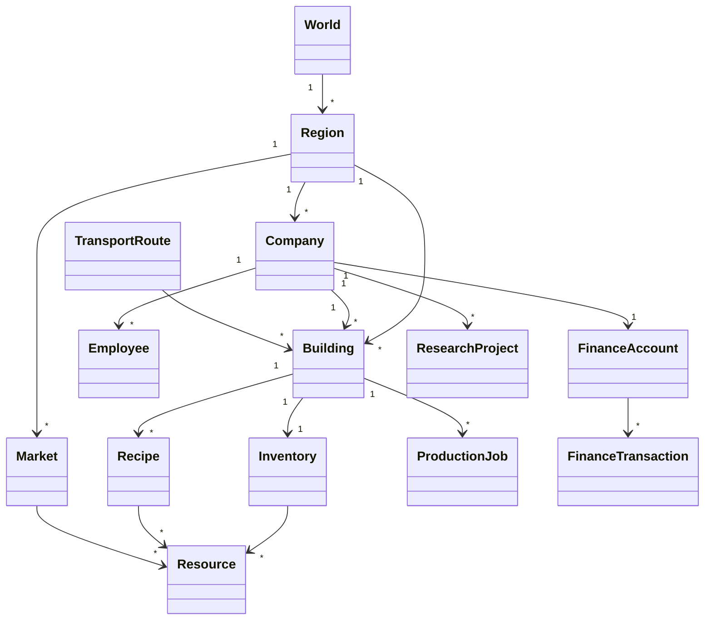
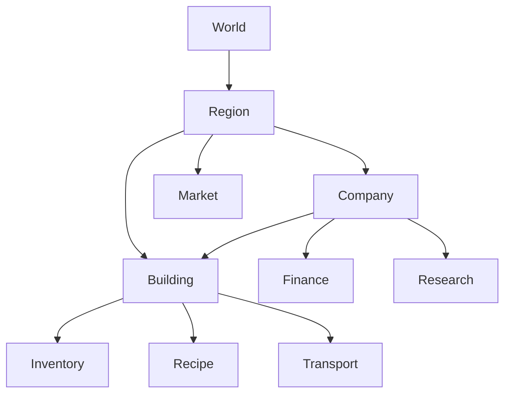

# Domain Model

Version: 1.0.0

Status: Draft

---

# Zweck

Dieses Dokument beschreibt das fachliche Domänenmodell von **Project Genesis**.

Es definiert die wichtigsten Domänenobjekte, ihre Verantwortlichkeiten und ihre Beziehungen zueinander. Das Domänenmodell bildet die Grundlage für die Implementierung der `domain`-Schicht sowie für die Simulation Engine.

Dieses Dokument beschreibt **keine technische Implementierung**, sondern ausschließlich die fachliche Struktur des Spiels.

---

# Architekturprinzipien

Das Domänenmodell folgt den Prinzipien des Domain-Driven Design (DDD).

Die wichtigsten Grundsätze sind:

- Geschäftslogik gehört ausschließlich in die Domain.
- Die Domain kennt keine UI.
- Die Domain kennt keine Persistenz.
- Die Domain kennt keine Rendering-Engine.
- Die Domain ist vollständig testbar.
- Die Simulation arbeitet deterministisch.

---

# Überblick

```text
                    World
                      │
        ┌─────────────┴─────────────┐
        │                           │
     Region                    Resource Graph
        │                           │
        │                           │
   ┌────┴────┐                      │
   │         │                      │
Company   Market                    │
   │         │                      │
   │         │                      │
Buildings  Finance                  │
   │
   │
Production
   │
Inventory
   │
Transport
```

Alle Systeme interagieren über klar definierte Domänengrenzen.

---

# Entity Relationship Diagram



# Aggregate Overview



# Aggregate

Die folgenden Aggregate bilden die zentralen Konsistenzgrenzen der Domäne.

## World

Verantwortlich für:

- Regionen
- Weltparameter
- Simulationszeit
- globale Ereignisse

Root Entity

```
World
```

---

## Region

Verantwortlich für:

- Gebäude
- Unternehmen
- Märkte
- Infrastruktur
- Ressourcenverteilung

Root Entity

```
Region
```

---

## Company

Verantwortlich für:

- Unternehmensdaten
- Gebäude
- Mitarbeitende
- Finanzen
- Forschung

Root Entity

```
Company
```

---

## Building

Verantwortlich für:

- Produktionskapazität
- Lager
- Energiebedarf
- unterstützte Rezepte

Root Entity

```
Building
```

---

## Market

Verantwortlich für:

- Preise
- Angebot
- Nachfrage
- Handelsvolumen

Root Entity

```
Market
```

---

## Research

Verantwortlich für:

- Technologien
- Freischaltungen
- Forschungsfortschritt

Root Entity

```
ResearchProject
```

---

## Finance

Verantwortlich für:

- Konten
- Buchungen
- Liquidität
- Investitionen

Root Entity

```
FinanceAccount
```

---

# Entities

Die wichtigsten Entities sind:

```text
World
Region

Company
Employee

Building
Warehouse

Recipe
ProductionJob

Inventory

Market

ResearchProject

FinanceAccount
FinanceTransaction

TransportRoute
TransportVehicle
```

Entities besitzen eine dauerhafte Identität gemäß DD-003.

---

# Value Objects

Die Domain verwendet unveränderliche Value Objects.

Beispiele:

```text
Money

Quantity

ResourceAmount

Capacity

EnergyAmount

Duration

Percentage

Coordinate

Position

Price
```

Value Objects besitzen keine eigene Identität.

---

# Domain Services

Komplexe Geschäftslogik wird in Domain Services ausgelagert.

Beispiele:

```text
ProductionPlanner

MarketPricingService

FinanceService

TransportPlanner

ResearchService

EmployeeAllocationService

EnergyDistributionService

SimulationClock
```

---

# Domain Events

Die Simulation erzeugt ausschließlich fachliche Ereignisse.

Beispiele:

```text
BuildingConstructed

ProductionStarted

ProductionCompleted

InventoryChanged

MarketPriceChanged

ResearchCompleted

TransportArrived

EmployeeHired

CompanyExpanded

CompanyBankrupt
```

Domain Events werden nach Abschluss eines Simulationsticks veröffentlicht.

---

# Aggregate-Beziehungen

```text
World
 └── Region

Region
 ├── Company
 ├── Market
 └── Buildings

Company
 ├── Finance
 ├── Employees
 ├── Buildings
 └── Research

Building
 ├── Inventory
 ├── Recipes
 └── ProductionJobs
```

Aggregate referenzieren sich ausschließlich über IDs.

Direkte Objektgraphen zwischen Aggregaten sind nicht zulässig.

---

# Invarianten

Die Domain garantiert unter anderem folgende Regeln:

## Company

- Kontostand darf nicht unbegrenzt negativ werden.
- Gebäude gehören genau einem Unternehmen.

---

## Building

- Kapazität darf nicht negativ sein.
- Produktion benötigt Ressourcen.
- Produktion benötigt Energie.

---

## Market

- Preise sind niemals negativ.
- Handelsvolumen ist ≥ 0.

---

## Inventory

- Bestände sind niemals negativ.
- Ressourcen existieren nur einmal pro Slot.

---

## Transport

- Eine Ressource befindet sich entweder im Lager oder im Transport.

---

# Identität

Alle Entities verwenden Global Identifiers gemäß DD-003.

Beispiele:

```text
company_001

building_steelmill_03

recipe_reinforced_steel

market_europe

region_north
```

---

# Lebensdauer

Entities entstehen ausschließlich durch Domain Services.

Sie werden niemals direkt erzeugt oder gelöscht.

Die Verwaltung erfolgt deterministisch innerhalb der Simulation.

---

# Beziehungen

```text
Company
    │
owns
    │
Building
    │
executes
    │
Recipe
    │
produces
    │
Resource
    │
stored in
    │
Inventory
    │
sold on
    │
Market
```

---

# Domänenregeln

Die wichtigsten Regeln lauten:

- Gebäude produzieren nicht selbst.
- Rezepte definieren Produktion.
- Märkte bestimmen Preise.
- Unternehmen besitzen Gebäude.
- Energie begrenzt Produktion.
- Forschung erweitert Möglichkeiten.
- Transporte verbinden Produktionsstandorte.
- Alle Simulation erfolgt deterministisch.

---

# Schichten

```text
Application

↓

Domain

↓

Infrastructure
```

Die Domain besitzt keinerlei Abhängigkeiten zu Infrastructure oder UI.

---

# Verzeichnisstruktur

Das Dokument bildet die Grundlage für:

```text
src/

domain/

world/
region/

company/
employee/

building/
production/
recipe/

inventory/

transport/

market/

finance/

research/

energy/

events/

value-objects/
```

---

# Qualitätsziele

Das Domänenmodell unterstützt:

- Wartbarkeit
- Testbarkeit
- Erweiterbarkeit
- Determinismus
- Datengetriebenes Design
- Modding
- Klare Verantwortlichkeiten

---

# Referenzen

- SAD.md
- DDD.md
- DD-003 – Global Identifiers
- DD-006 – Economic Simulation
- DD-009 – Deterministic Simulation
- DD-011 – Recipe-Based Production
- DD-027 – Event-Driven Simulation Architecture
