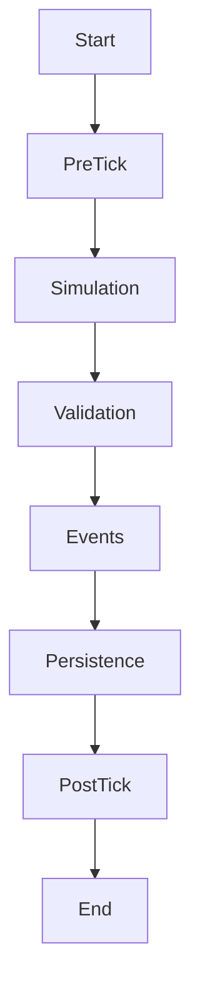
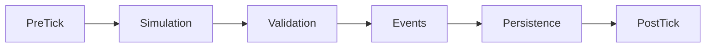
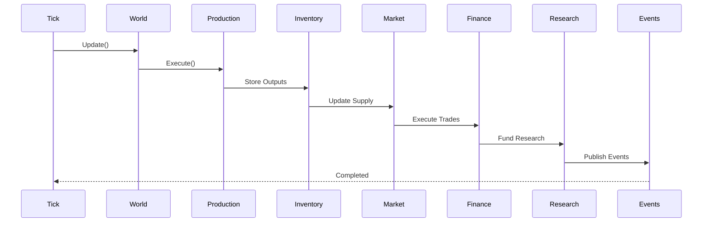

# Runtime View

Version: 1.0.0

Status: Draft

---

# Zweck

Dieses Dokument beschreibt den Laufzeitablauf (Runtime View) von **Project Genesis**.

Es definiert die Reihenfolge der Simulationssysteme, den Tick-Zyklus und den Austausch von Domain Events.

Die Runtime View stellt sicher, dass die Simulation deterministisch, reproduzierbar und unabhängig von Framerate oder Hardware ausgeführt wird.

---

# Architekturprinzipien

Die Laufzeitarchitektur basiert auf:

- Deterministic Simulation (DD-009)
- Event-Driven Simulation (DD-027)
- CQRS Lite (DD-028)
- Recipe-Based Production (DD-011)

---

# Überblick


# Tick-Zyklus

Ein Simulationstick besteht aus den folgenden Phasen:

1. Tick starten
2. Welt aktualisieren
3. Unternehmen aktualisieren
4. Mitarbeitende simulieren
5. Energieversorgung berechnen
6. Produktion ausführen
7. Lagerbestände aktualisieren
8. Transporte verarbeiten
9. Markt berechnen
10. Finanzen aktualisieren
11. Forschung fortschreiben
12. Domain Events veröffentlichen
13. Autosave prüfen
14. Tick abschließen

---

# Tick Lifecycle

Jeder Simulationstick durchläuft dieselben sechs Phasen.



## Phase 1 – PreTick

Vorbereitung des nächsten Ticks.

Beispiele:

- TickContext erzeugen
- Event Queue leeren
- Zufallszahlengenerator initialisieren
- Performance-Metriken starten

---

## Phase 2 – Simulation

Ausführung sämtlicher Simulationssysteme.

```text
World

↓

Company

↓

Employees

↓

Energy

↓

Production

↓

Inventory

↓

Transport

↓

Market

↓

Finance

↓

Research
```

Während dieser Phase dürfen ausschließlich Domain-Daten verändert werden.

---

## Phase 3 – Validation

Nach Abschluss aller Systeme werden Invarianten überprüft.

Beispiele:

- keine negativen Lagerbestände
- keine ungültigen Referenzen
- Energieverbrauch konsistent
- Finanzdaten konsistent

Bei einem Fehler wird der Tick verworfen.

---

## Phase 4 – Events

Alle während des Ticks erzeugten Domain Events werden veröffentlicht.

Beispiele:

- ProductionCompleted
- TransportArrived
- MarketPriceChanged
- ResearchCompleted

Neue Events dürfen keine Änderungen mehr am bereits abgeschlossenen Tick verursachen.

---

## Phase 5 – Persistence

Optional werden:

- Autosaves erstellt
- Telemetriedaten geschrieben
- Debug-Informationen gespeichert

Diese Phase verändert keine Domänendaten.

---

## Phase 6 – PostTick

Abschlussarbeiten.

Beispiele:

- Statistiken aktualisieren
- Performance messen
- Logging
- Vorbereitung des nächsten Ticks

# Sequenzdiagramm



---

# Simulation Pipeline

```mermaid
flowchart LR

Start

UpdateWorld

UpdateCompanies

UpdateEmployees

UpdateEnergy

ExecuteProduction

UpdateInventory

ExecuteTransport

UpdateMarket

UpdateFinance

UpdateResearch

PublishEvents

End

Start --> UpdateWorld
UpdateWorld --> UpdateCompanies
UpdateCompanies --> UpdateEmployees
UpdateEmployees --> UpdateEnergy
UpdateEnergy --> ExecuteProduction
ExecuteProduction --> UpdateInventory
UpdateInventory --> ExecuteTransport
ExecuteTransport --> UpdateMarket
UpdateMarket --> UpdateFinance
UpdateFinance --> UpdateResearch
UpdateResearch --> PublishEvents
PublishEvents --> End
```



---

# Tick Scheduler

Der Tick Scheduler ist verantwortlich für:

- feste Tickrate
- deterministische Reihenfolge
- Zeitsteuerung
- Pausieren
- Beschleunigung
- Einzel-Tick-Debugging

Der Scheduler enthält keine Geschäftslogik.

---

# Simulation Systems

## World System

Aktualisiert:

- Simulationszeit
- Regionen
- globale Ereignisse

---

## Company System

Aktualisiert:

- Unternehmensstatus
- Expansion
- Investitionen

---

## Employee System

Berechnet:

- Arbeitskräfte
- Produktivität
- Verfügbarkeit

---

## Energy System

Berechnet:

- Energieproduktion
- Energieverbrauch
- Energieverteilung

---

## Production System

Verarbeitet:

- Rezepte
- Produktionsfortschritt
- Ressourcenverbrauch

---

## Inventory System

Aktualisiert:

- Lager
- Reservierungen
- Bestände

---

## Transport System

Verarbeitet:

- Warenbewegung
- Lieferungen
- Transportfortschritt

---

## Market System

Berechnet:

- Angebot
- Nachfrage
- Preise
- Handelsvolumen

---

## Finance System

Berechnet:

- Einnahmen
- Ausgaben
- Liquidität
- Bilanz

---

## Research System

Berechnet:

- Forschungsfortschritt
- Freischaltungen
- neue Rezepte

---

# Domain Events

Während eines Ticks werden Events gesammelt.

Beispiele:

- ProductionCompleted
- InventoryChanged
- TransportArrived
- MarketPriceChanged
- ResearchCompleted
- CompanyExpanded

Events werden **nicht sofort verarbeitet**, sondern erst nach Abschluss aller Systeme veröffentlicht.

Dadurch bleiben alle Systeme deterministisch.

---

# Fehlerbehandlung

Ein Fehler innerhalb eines Systems:

- beendet den aktuellen Tick kontrolliert
- erzeugt einen Log-Eintrag
- beschädigt keine Domänendaten

Teilaktualisierte Zustände sind nicht zulässig.

---

# Parallelisierung

Die Reihenfolge der Systeme bleibt unverändert.

Innerhalb eines Systems dürfen unabhängige Berechnungen parallelisiert werden, sofern das Ergebnis deterministisch bleibt.

Beispiele:

- Preisberechnung pro Markt
- Produktionsberechnung je Region
- Transportberechnung je Route

---

# Tick-Regeln

Während eines Simulationsticks gelten folgende Regeln:

- Jeder Tick wird vollständig abgeschlossen.
- Systeme werden niemals übersprungen.
- Events werden erst nach Abschluss aller Systeme veröffentlicht.
- Persistenz erfolgt ausschließlich nach erfolgreicher Validierung.
- Fehler führen zum Abbruch des aktuellen Ticks.
- Es existiert niemals ein teilweise abgeschlossener Tick.

# Performance-Ziele

Ziele der Runtime:

- konstante Tickdauer
- reproduzierbare Ergebnisse
- skalierbar auf große Spielwelten
- minimale Speicherallokationen während eines Ticks

---

# Verzeichnisstruktur

```text
src/

simulation/

engine/
│
├── SimulationEngine.ts
├── TickScheduler.ts
├── TickContext.ts

systems/
│
├── WorldSystem.ts
├── CompanySystem.ts
├── EmployeeSystem.ts
├── EnergySystem.ts
├── ProductionSystem.ts
├── InventorySystem.ts
├── TransportSystem.ts
├── MarketSystem.ts
├── FinanceSystem.ts
└── ResearchSystem.ts

events/
│
├── EventBus.ts
├── EventQueue.ts
└── DomainEvents.ts
```

---

# Debugging

Jeder Tick besitzt eine eindeutige Tick-ID.

Während der Entwicklung können folgende Modi aktiviert werden:

- Einzel-Tick-Ausführung
- Breakpoint nach jeder Phase
- Aufzeichnung aller Domain Events
- Performance-Messung je System

Dadurch lassen sich Simulationsfehler reproduzierbar analysieren.

# Performance

Die Simulation verfolgt folgende Ziele:

- konstante Tickdauer
- keine unnötigen Speicherallokationen
- deterministische Parallelisierung
- reproduzierbare Ergebnisse

Langfristiges Ziel:

Simulation von mehreren tausend Gebäuden, Unternehmen und Transporten pro Tick auf handelsüblicher Hardware.

# Qualitätsziele

Die Runtime View unterstützt:

- Determinismus
- Performance
- Wartbarkeit
- Testbarkeit
- Erweiterbarkeit
- klare Verantwortlichkeiten

---

# Referenzen

- architecture-overview.md
- component-diagram.md
- bounded-contexts.md
- domain-model.md
- DD-009 – Deterministic Simulation
- DD-011 – Recipe-Based Production
- DD-027 – Event-Driven Simulation Architecture
- DD-028 – CQRS Lite
- DD-032 – Deterministic Tick Processing

---

# Änderungsprotokoll

| Version | Datum | Änderung |
|----------|--------|----------|
| 1.0.0 | 2026-07-06 | Initiale Runtime View |
| 1.1.0 | 2026-07-06 | Einführung eines expliziten Tick-Lifecycles mit sechs Phasen, Validierungsschritt, Debugging-Strategie und erweiterten Laufzeitregeln |