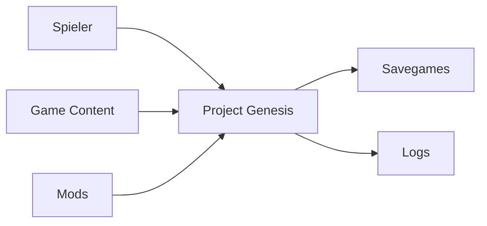
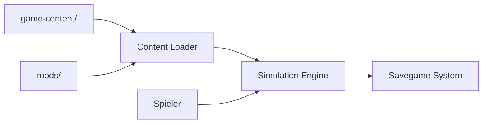

# System Context

Version: 1.0.0

Status: Draft

---

# Zweck

Dieses Dokument beschreibt den Systemkontext von **Project Genesis**.

Es definiert die Grenzen des Systems sowie alle externen Akteure und Systeme, mit denen Project Genesis interagiert.

Der Fokus liegt auf der fachlichen Systemgrenze – nicht auf der internen Implementierung.

---

# Architekturprinzipien

Project Genesis ist eine lokal ausgeführte Simulation.

Grundsätze:

- Die Simulation läuft vollständig lokal.
- Gameplay benötigt keine Internetverbindung.
- Die Spielsimulation ist unabhängig von externen Diensten.
- Externe Systeme sind optional und dürfen die Kernsimulation nicht beeinflussen.

---

# System Context Diagram



---

# Systemgrenze

```text
+------------------------------------------------------+
|                Project Genesis                       |
|                                                      |
|  Simulation Engine                                   |
|  Domain Model                                        |
|  Content Loader                                      |
|  Event System                                        |
|  Savegame System                                     |
+------------------------------------------------------+

Außerhalb:

- Spieler
- Game Content
- Mods
- Savegames
- Log-Dateien
```

---

# Akteure

## Spieler

Der Spieler ist der primäre Akteur.

Er kann:

- Unternehmen gründen
- Gebäude errichten
- Forschung starten
- Transporte planen
- Simulation steuern
- Spielstände laden und speichern

Der Spieler verändert die Simulation ausschließlich über definierte Anwendungsfälle.

---

# Externe Ressourcen

## Game Content

Verzeichnis:

```text
game-content/
```

Enthält:

- Ressourcen
- Gebäude
- Rezepte
- Regionen
- Unternehmen
- Forschung
- Energie
- Märkte

Diese Inhalte werden beim Spielstart geladen und validiert.

---

## Mods

Verzeichnis:

```text
mods/
```

Mods erweitern ausschließlich den Content.

Sie dürfen keine Domänenlogik verändern.

---

## Savegames

Verzeichnis (beispielhaft):

```text
savegames/
```

Speichert:

- Weltzustand
- Unternehmen
- Gebäude
- Märkte
- Forschung
- Ticknummer

Savegames enthalten keine Gameplay-Definitionen aus `game-content/`.

---

## Logs

Verzeichnis:

```text
logs/
```

Enthält:

- Fehlerprotokolle
- Performance-Metriken
- Debug-Informationen
- Tick-Protokolle (optional)

Logs dienen ausschließlich der Analyse.

---

# Datenfluss



---

# Verantwortlichkeiten

## Project Genesis

Verantwortlich für:

- Simulation
- Wirtschaftssystem
- Produktionssystem
- Forschung
- Transport
- Märkte
- Energie
- Persistenz

---

## Spieler

Verantwortlich für:

- Entscheidungen
- Strategien
- Unternehmensentwicklung

---

## Content

Verantwortlich für:

- Gameplay-Definitionen
- Balancing
- Erweiterbarkeit

---

# Nicht Teil des Systems

Folgende Systeme gehören ausdrücklich **nicht** zum Kernsystem:

- Multiplayer
- Cloud-Synchronisation
- Online-Services
- Telemetrie-Server
- DRM
- Zahlungsdienste

Diese können später ergänzt werden, sind jedoch keine Voraussetzung für die Kernarchitektur.

---

# Erweiterungsmöglichkeiten

Die Architektur erlaubt optionale Integrationen, beispielsweise:

- Steam Workshop
- Cloud Savegames
- Mod-Plattformen
- Statistikauswertung

Diese Erweiterungen erfolgen ausschließlich über definierte Infrastruktur-Schnittstellen.

---

# Schnittstellen

## Eingehend

- Benutzereingaben
- Gameplay-Inhalte (`game-content/`)
- Mods
- Savegames

## Ausgehend

- Savegames
- Log-Dateien
- Debug-Ausgaben

---

# Qualitätsziele

Der Systemkontext unterstützt:

- klare Systemgrenzen
- Offline-Fähigkeit
- Modding
- Wartbarkeit
- Austauschbarkeit der Infrastruktur
- langfristige Erweiterbarkeit

---

# Referenzen

- architecture-overview.md
- SAD.md
- DDD.md
- domain-model.md
- bounded-contexts.md
- component-diagram.md
- runtime-view.md
- DD-024 – Data-Driven Game Configuration
- DD-025 – Content Validation Pipeline
- DD-030 – Configuration-Driven Game Content
- DD-031 – Game Content Organization