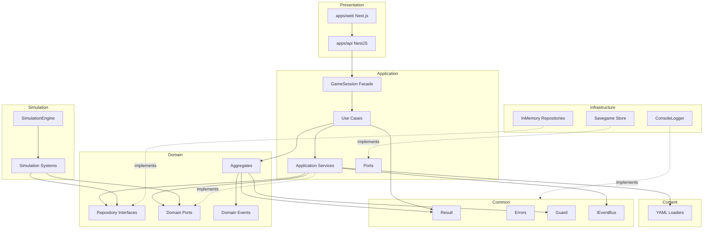

# AUD-002 — Architecture Audit Export (Implementation Report)

**Project:** Project Genesis  
**Audit ID:** AUD-002  
**Type:** Implementation Export (Read-Only)  
**Version:** 1.0  
**Status:** Completed  
**Date:** 2026-07-18  
**Baseline Commit:** Architecture Compliance Phase 1 (`0ef6e1d`)

---

# Purpose

This document is a complete, read-only architecture audit export of the current implementation state. It contains no refactorings or recommendations for immediate code changes — only factual inventory, structure, and known gaps.

**Related audits:**

| Audit              | Document                                         |
| ------------------ | ------------------------------------------------ |
| AUD-001            | `docs/audits/ARCHITECTURE_STANDARDS_SYNC.md`     |
| Phase 1 Compliance | `docs/quality/ARCHITECTURE_COMPLIANCE_REPORT.md` |

---

# 1. Projektstruktur (Ordnerbaum)

## Repository Root

```
Project Genesis/
├── apps/                    # Presentation layer (NestJS API + Next.js Web)
├── docs/                    # Architecture, gameplay, art, quality, audits
├── game-content/            # YAML game data (resources, buildings, recipes, …)
├── src/                     # Core application (Clean Architecture)
├── tests/                   # Shared fixtures, helpers, architecture tests
├── tools/                   # Content validation CLI
├── package.json
├── tsconfig.json
└── vitest.config.ts
```

## `src/` — Core Layers

```
src/
├── main.ts                          # Console entry point
├── readme.md
│
├── application/                     # Application Layer
│   ├── bootstrap/                     # Composition root, ApplicationContext
│   ├── commands/                      # Immutable command DTOs (9)
│   ├── facade/                        # GameSession browser/API facade
│   ├── persistence/                   # Savegame schema (application-owned)
│   ├── ports/                         # Application port interfaces
│   ├── queries/                       # CQRS query handlers (6 pairs)
│   ├── read-models/                   # Query result DTOs (8)
│   ├── services/                      # Application services (9)
│   ├── use-cases/                     # Use case classes (9)
│   └── index.ts
│
├── common/                            # Shared / Cross-Cutting
│   ├── core/                          # Entity, ValueObject, AggregateRoot, Identifier
│   ├── errors/                        # ProjectGenesisError hierarchy
│   ├── events/                        # DomainEvent, IEventBus, InMemoryEventBus
│   ├── logging/                       # Logger contract, LogLevel, LogCategory
│   ├── result/                        # Result<T, E> pattern
│   ├── time/                          # Clock, ManualClock
│   └── validation/                    # Guard helpers
│
├── content/                           # Content Layer (YAML loading)
│   ├── building/, milestone/, recipe/, research/, resource/
│   ├── errors/                        # ContentLoadError
│   └── validate*.ts                   # Cross-content validation
│
├── domain/                            # Domain Layer
│   ├── building/, company/, energy/, finance/, inventory/
│   ├── market/, milestone/, production/, research/, transport/
│   ├── shared/                        # Money, Quantity, Capacity, ResourceAmount
│   ├── policies/                      # Domain policies (2)
│   ├── specifications/                # Domain specifications (6)
│   └── readme.md
│
├── infrastructure/                    # Infrastructure Layer
│   ├── logging/                       # ConsoleLogger, NullLogger
│   ├── persistence/                   # InMemory repositories, savegame I/O
│   │   └── savegame/                  # FileSavegameStore, GameStateSerializer
│   └── readme.md
│
├── simulation/                        # Simulation Engine
│   ├── engine/                        # SimulationEngine, SimulationSystem, TickContext
│   ├── events/                        # EventQueue
│   ├── state/                         # SimulationState
│   ├── systems/                       # 7 simulation systems + factory
│   └── time/                          # TickClock
│
└── ui/                                # Placeholder (readme only)
    └── readme.md
```

## `apps/` — Presentation Layer

```
apps/
├── api/                             # NestJS REST + WebSocket API
│   └── src/
│       ├── main.ts
│       ├── app.module.ts, app.controller.ts
│       ├── common/                  # api-response, unwrap-result, exception filter
│       ├── config/                  # project-paths
│       ├── dashboard/               # WebSocket gateway, broadcast service
│       └── game/                    # GameController, DTOs, GameSessionService
│
└── web/                             # Next.js dashboard UI
    └── src/
        ├── app/                     # layout, page, CSS
        ├── components/              # DashboardShell, charts, DataTable
        └── lib/                     # api.ts, dashboard-socket.ts
```

## `tests/` — Shared Test Infrastructure

```
tests/
├── architecture/                    # Architecture compliance tests (2)
├── fixtures/                        # YAML test content
└── helpers/                         # completeBuildingConstruction, createTransportTestServices
```

---

# 2. Alle Layer

## Domain Layer

**Path:** `src/domain/`  
**Production files:** 87  
**Responsibility:** Business model, invariants, aggregates, repository contracts, domain events, policies, specifications.

| Bounded Context   | Key Aggregates / Entities                             | Repository Interface                                 |
| ----------------- | ----------------------------------------------------- | ---------------------------------------------------- |
| `building/`       | `Building`, `BuildingStorage`, `Position`             | `BuildingRepository`, `BuildingStorageRepository`    |
| `company/`        | `Company`                                             | `CompanyRepository`                                  |
| `energy/`         | — (port only)                                         | —                                                    |
| `finance/`        | `FinanceAccount`, `FinanceTransaction`                | `FinanceRepository`                                  |
| `inventory/`      | `Inventory`                                           | `InventoryRepository`                                |
| `market/`         | `Market`                                              | `MarketRepository`                                   |
| `milestone/`      | `CompanyMilestones`                                   | `CompanyMilestonesRepository`                        |
| `production/`     | `ProductionJob`                                       | `ProductionJobRepository`                            |
| `research/`       | `ResearchJob`, `CompanyResearch`, `Technology`        | `ResearchJobRepository`, `CompanyResearchRepository` |
| `transport/`      | `TransportOrder`                                      | `TransportOrderRepository`                           |
| `shared/`         | `Money`, `Quantity`, `Capacity`, `ResourceAmount`     | —                                                    |
| `policies/`       | `ConstructionCostPolicy`, `InstantTradePricingPolicy` | —                                                    |
| `specifications/` | 6 specification classes + `AndSpecification`          | —                                                    |

**Dependency rule:** Domain imports only `src/common/` and internal domain modules. No imports from application, infrastructure, simulation, or content.

---

## Application Layer

**Path:** `src/application/`  
**Production files:** 58  
**Responsibility:** Use case orchestration, application services, CQRS queries, facade, composition root.

| Submodule      | Contents                                                                       |
| -------------- | ------------------------------------------------------------------------------ |
| `bootstrap/`   | `bootstrapApplication`, `restoreApplicationFromSnapshot`, `ApplicationContext` |
| `commands/`    | 9 immutable command types                                                      |
| `use-cases/`   | 9 use case classes                                                             |
| `services/`    | 9 application services                                                         |
| `queries/`     | 6 query + handler pairs                                                        |
| `read-models/` | 8 read model types                                                             |
| `facade/`      | `GameSession`, `GameSessionDashboard`, `GameSessionDashboardBuilder`           |
| `ports/`       | 3 port interfaces + related types                                              |
| `persistence/` | `GameSaveSnapshotV1` schema                                                    |

---

## Infrastructure Layer

**Path:** `src/infrastructure/`  
**Production files:** 18  
**Responsibility:** Technical implementations — persistence, logging, filesystem I/O.

| Submodule               | Contents                                                     |
| ----------------------- | ------------------------------------------------------------ |
| `persistence/`          | 12 `InMemory*Repository` implementations                     |
| `persistence/savegame/` | `FileSavegameStore`, `GameStateSerializer`, schema re-export |
| `logging/`              | `ConsoleLogger`, `NullLogger`                                |
| `http/`                 | Empty (planned)                                              |

---

## Presentation Layer

**Path:** `apps/` + `src/ui/` (placeholder)  
**Responsibility:** HTTP API, WebSocket dashboard refresh, browser UI.

| Component        | Technology       | Path                                          |
| ---------------- | ---------------- | --------------------------------------------- |
| REST API         | NestJS           | `apps/api/src/game/game.controller.ts`        |
| WebSocket        | NestJS Gateway   | `apps/api/src/dashboard/dashboard.gateway.ts` |
| API ↔ Facade     | Service adapter  | `apps/api/src/game/game-session.service.ts`   |
| Result → HTTP    | Exception mapper | `apps/api/src/common/unwrap-result.ts`        |
| Web Dashboard    | Next.js + React  | `apps/web/src/app/page.tsx`                   |
| Web API Client   | TypeScript fetch | `apps/web/src/lib/api.ts`                     |
| WebSocket Client | Socket.IO        | `apps/web/src/lib/dashboard-socket.ts`        |
| Console UI       | Placeholder      | `src/ui/readme.md`                            |

---

## Additional Layers (Cross-Cutting / Specialized)

| Layer          | Path              | Role                                                                |
| -------------- | ----------------- | ------------------------------------------------------------------- |
| **Common**     | `src/common/`     | Shared primitives (Result, errors, events, logging contract, Guard) |
| **Content**    | `src/content/`    | YAML loading, validation, registries                                |
| **Simulation** | `src/simulation/` | Deterministic tick engine and systems                               |

---

# 3. Alle Ports

## Application Ports

**Owner:** Application Layer  
**Path:** `src/application/ports/`

| Port                          | Methods / Contract                                                 | Implemented By                    |
| ----------------------------- | ------------------------------------------------------------------ | --------------------------------- |
| `SavegameStore`               | `save()`, `load()`                                                 | `FileSavegameStore`               |
| `GameStateSerializerPort`     | `serialize()`, `parse()`, `hydrate()`                              | `GameStateSerializer`             |
| `TickHistorySnapshotProvider` | `getCompanyId()`, `exportForSave()`, `replaceHistory()`, `clear()` | `TickHistoryService` (structural) |

**Related types (same module):**

- `GameStateSource`, `GameStateTarget`, `RestoredSimulationMetadata` — in `GameStateSerializerPort.ts`

---

## Domain Ports

**Owner:** Domain Layer

| Port                     | Path                                             | Methods                    | Implemented By              |
| ------------------------ | ------------------------------------------------ | -------------------------- | --------------------------- |
| `EnergyBalancePort`      | `src/domain/energy/EnergyBalancePort.ts`         | `canAffordRecipeEnergy()`  | `EnergyBalanceService`      |
| `TransportLogisticsPort` | `src/domain/transport/TransportLogisticsPort.ts` | `completeTransportOrder()` | `TransportLogisticsService` |

---

## Common Abstractions (Port-Equivalent)

| Interface                             | Path                                         | Implementations                                       |
| ------------------------------------- | -------------------------------------------- | ----------------------------------------------------- |
| `Clock`                               | `src/common/time/Clock.ts`                   | `ManualClock`                                         |
| `TickClock extends Clock`             | `src/simulation/time/TickClock.ts`           | (via ManualClock)                                     |
| `Logger`                              | `src/common/logging/Logger.ts`               | `ConsoleLogger`, `NullLogger`                         |
| `IEventBus`                           | `src/common/events/IEventBus.ts`             | `InMemoryEventBus`                                    |
| `Policy<TContext, TDecision>`         | `src/domain/policies/Policy.ts`              | `ConstructionCostPolicy`, `InstantTradePricingPolicy` |
| `Specification<TCandidate, TContext>` | `src/domain/specifications/Specification.ts` | 6 specification classes                               |

---

# 4. Alle Adapter

No class uses the suffix `*Adapter`. Adapters are identified by `implements` or structural conformance.

## Infrastructure → Application Port Adapters

| Class                 | Port                      | Path                                                             |
| --------------------- | ------------------------- | ---------------------------------------------------------------- |
| `FileSavegameStore`   | `SavegameStore`           | `src/infrastructure/persistence/savegame/FileSavegameStore.ts`   |
| `GameStateSerializer` | `GameStateSerializerPort` | `src/infrastructure/persistence/savegame/GameStateSerializer.ts` |

## Application → Domain Port Adapters

| Class                       | Port                          | Path                                                    |
| --------------------------- | ----------------------------- | ------------------------------------------------------- |
| `EnergyBalanceService`      | `EnergyBalancePort`           | `src/application/services/EnergyBalanceService.ts`      |
| `TransportLogisticsService` | `TransportLogisticsPort`      | `src/application/services/TransportLogisticsService.ts` |
| `TickHistoryService`        | `TickHistorySnapshotProvider` | `src/application/services/TickHistoryService.ts`        |

## Common / Infrastructure Adapters

| Class              | Interface   | Path                                          |
| ------------------ | ----------- | --------------------------------------------- |
| `InMemoryEventBus` | `IEventBus` | `src/common/events/InMemoryEventBus.ts`       |
| `ManualClock`      | `Clock`     | `src/common/time/ManualClock.ts`              |
| `ConsoleLogger`    | `Logger`    | `src/infrastructure/logging/ConsoleLogger.ts` |
| `NullLogger`       | `Logger`    | `src/infrastructure/logging/NullLogger.ts`    |

## Presentation Adapters

| Component             | Adapts                                            | Path                                        |
| --------------------- | ------------------------------------------------- | ------------------------------------------- |
| `unwrap-result.ts`    | `Result<T, ProjectGenesisError>` → HTTP exception | `apps/api/src/common/unwrap-result.ts`      |
| `GameController`      | HTTP DTOs → `GameSession` facade                  | `apps/api/src/game/game.controller.ts`      |
| `GameSessionService`  | NestJS lifecycle → `GameSession` singleton        | `apps/api/src/game/game-session.service.ts` |
| `api.ts`              | Browser fetch → REST API                          | `apps/web/src/lib/api.ts`                   |
| `dashboard-socket.ts` | Browser WebSocket → dashboard refresh             | `apps/web/src/lib/dashboard-socket.ts`      |

---

# 5. Repository-Struktur

## Pattern

```
Domain Layer          Infrastructure Layer
─────────────────     ─────────────────────────────
<Entity>Repository   InMemory<Entity>Repository
(interface)           (concrete implementation)
```

## Complete Repository Matrix

| Repository Interface          | Domain Path          | Implementation                        | Infra Path                    | Tests |
| ----------------------------- | -------------------- | ------------------------------------- | ----------------------------- | ----- |
| `BuildingRepository`          | `domain/building/`   | `InMemoryBuildingRepository`          | `infrastructure/persistence/` | Yes   |
| `BuildingStorageRepository`   | `domain/building/`   | `InMemoryBuildingStorageRepository`   | `infrastructure/persistence/` | No    |
| `CompanyRepository`           | `domain/company/`    | `InMemoryCompanyRepository`           | `infrastructure/persistence/` | Yes   |
| `FinanceRepository`           | `domain/finance/`    | `InMemoryFinanceRepository`           | `infrastructure/persistence/` | Yes   |
| `InventoryRepository`         | `domain/inventory/`  | `InMemoryInventoryRepository`         | `infrastructure/persistence/` | Yes   |
| `MarketRepository`            | `domain/market/`     | `InMemoryMarketRepository`            | `infrastructure/persistence/` | No    |
| `ProductionJobRepository`     | `domain/production/` | `InMemoryProductionJobRepository`     | `infrastructure/persistence/` | Yes   |
| `ResearchJobRepository`       | `domain/research/`   | `InMemoryResearchJobRepository`       | `infrastructure/persistence/` | No    |
| `CompanyResearchRepository`   | `domain/research/`   | `InMemoryCompanyResearchRepository`   | `infrastructure/persistence/` | No    |
| `CompanyMilestonesRepository` | `domain/milestone/`  | `InMemoryCompanyMilestonesRepository` | `infrastructure/persistence/` | No    |
| `TransportOrderRepository`    | `domain/transport/`  | `InMemoryTransportOrderRepository`    | `infrastructure/persistence/` | No    |

**Barrel export:** `src/infrastructure/persistence/index.ts`  
**Note:** `InMemoryBuildingStorageRepository` and `InMemoryTransportOrderRepository` exist but are not exported from the barrel.

## Persistence Beyond Repositories

| Component             | Role                             | Path                                   |
| --------------------- | -------------------------------- | -------------------------------------- |
| `FileSavegameStore`   | JSON savegame I/O                | `infrastructure/persistence/savegame/` |
| `GameStateSerializer` | Snapshot serialize/parse/hydrate | `infrastructure/persistence/savegame/` |
| `GameSaveSnapshotV1`  | Schema (owned by application)    | `application/persistence/`             |

---

# 6. Event-System

## Architecture

```text
Aggregate
    ↓ pullDomainEvents()
DomainEvent
    ↓ enqueueEvents() / IEventBus.publish()
SimulationEngine / InMemoryEventBus
    ↓
Subscribers (MilestoneEvaluationService, …)
```

## Core Components

| Component          | Path                                    | Role                                                  |
| ------------------ | --------------------------------------- | ----------------------------------------------------- |
| `DomainEvent`      | `src/common/events/DomainEvent.ts`      | Abstract base (`eventName`, `occurredAt`, `freeze()`) |
| `IEventBus`        | `src/common/events/IEventBus.ts`        | Publish/subscribe contract                            |
| `InMemoryEventBus` | `src/common/events/InMemoryEventBus.ts` | In-process deterministic bus                          |
| `EventQueue`       | `src/simulation/events/EventQueue.ts`   | Tick-deferred event dispatch                          |
| `AggregateRoot`    | `src/common/core/AggregateRoot.ts`      | Collects domain events on aggregates                  |

## Domain Events (16)

| Event                           | `eventName`                     | Bounded Context | Path                        |
| ------------------------------- | ------------------------------- | --------------- | --------------------------- |
| `BuildingPlaced`                | `BuildingPlaced`                | building        | `domain/building/events/`   |
| `BuildingConstructionStarted`   | `BuildingConstructionStarted`   | building        | `domain/building/events/`   |
| `BuildingConstructionCompleted` | `BuildingConstructionCompleted` | building        | `domain/building/events/`   |
| `CompanyFounded`                | `CompanyFounded`                | company         | `domain/company/events/`    |
| `FinanceAccountCreated`         | `FinanceAccountCreated`         | finance         | `domain/finance/events/`    |
| `FinanceTransactionRecorded`    | `FinanceTransactionRecorded`    | finance         | `domain/finance/events/`    |
| `InventoryChanged`              | `InventoryChanged`              | inventory       | `domain/inventory/events/`  |
| `MarketPriceChanged`            | `MarketPriceChanged`            | market          | `domain/market/events/`     |
| `CompanyMilestoneReached`       | `CompanyMilestoneReached`       | milestone       | `domain/milestone/events/`  |
| `ProductionStarted`             | `ProductionStarted`             | production      | `domain/production/events/` |
| `ProductionCompleted`           | `ProductionCompleted`           | production      | `domain/production/events/` |
| `ResearchStarted`               | `ResearchStarted`               | research        | `domain/research/events/`   |
| `ResearchCompleted`             | `ResearchCompleted`             | research        | `domain/research/events/`   |
| `TechnologyCompleted`           | `TechnologyCompleted`           | research        | `domain/research/events/`   |
| `TransportCompleted`            | `TransportCompleted`            | transport       | `domain/transport/events/`  |

## Event Handlers / Subscribers

| Handler                         | Type                   | Trigger                                             | Path                             |
| ------------------------------- | ---------------------- | --------------------------------------------------- | -------------------------------- |
| `MilestoneEvaluationService`    | `IEventBus` subscriber | `FinanceTransactionRecorded`, `ProductionCompleted` | `application/services/`          |
| `ProductionJobCompletedHandler` | Callback               | Production system job completion                    | `simulation/systems/production/` |
| `ResearchJobCompletedHandler`   | Callback               | Research system job completion                      | `simulation/systems/research/`   |

**Bootstrap wiring:**

- `onProductionJobCompleted` → `ProductionInventoryService.completeJob()`
- `onResearchJobCompleted` → `ResearchCompletionService.completeJob()`

---

# 7. Error-Hierarchie

## Class Hierarchy

```text
ProjectGenesisError
├── DomainError
├── ValidationError
│   └── ValidationErrors
├── ApplicationError
├── InfrastructureError
├── PersistenceError
└── ContentLoadError          (content layer, category: Configuration)
```

## Error Categories

| Enum Value       | Used By                               |
| ---------------- | ------------------------------------- |
| `Domain`         | `DomainError`                         |
| `Validation`     | `ValidationError`, `ValidationErrors` |
| `Application`    | `ApplicationError`                    |
| `Infrastructure` | `InfrastructureError`                 |
| `Persistence`    | `PersistenceError`                    |
| `Configuration`  | `ContentLoadError`                    |
| `Network`        | (defined, not yet used)               |
| `Unexpected`     | (defined, not yet used)               |

## Error Severity

| Level                                 | Enum            |
| ------------------------------------- | --------------- |
| Debug, Info, Warning, Error, Critical | `ErrorSeverity` |

## Stable Error Code Registries

| Registry                  | Path                                   | Example Codes             |
| ------------------------- | -------------------------------------- | ------------------------- |
| `ValidationErrorCode`     | `common/errors/ValidationError.ts`     | `VAL-0001`, `VAL-0002`, … |
| `InfrastructureErrorCode` | `common/errors/InfrastructureError.ts` | `INF-0001`, …             |
| `PersistenceErrorCode`    | `common/errors/PersistenceError.ts`    | `PRS-0001`, …             |
| `ContentLoadErrorCode`    | `content/errors/ContentLoadError.ts`   | `CFG-0001`, …             |

## Base Error Properties

Every `ProjectGenesisError` carries:

- `errorCode` (format `AAA-0001`)
- `category` (`ErrorCategory`)
- `message`
- `cause` (optional)
- `timestamp`
- `context` (frozen record)
- `severity` (`ErrorSeverity`)
- `code` (backward-compatible alias for `errorCode`)

---

# 8. Result Pattern

## Implementation

**Path:** `src/common/result/Result.ts`  
**Tests:** `src/common/result/Result.test.ts` (28 test cases)

## Type Contract

```typescript
type Result<TValue, TError = unknown> =
  { readonly ok: true; readonly value: TValue } | { readonly ok: false; readonly error: TError };
```

## API Surface

| Category  | Methods                                                                                |
| --------- | -------------------------------------------------------------------------------------- |
| Factory   | `Result.ok()`, `Result.fail()`                                                         |
| Guards    | `Result.isOk()`, `Result.isSuccess()`, `Result.isFailure()`                            |
| Unwrap    | `Result.getValue()`, `Result.getError()`, `Result.unwrapOr()`, `Result.unwrapOrElse()` |
| Transform | `Result.map()`, `Result.flatMap()`, `Result.mapError()`, `Result.fold()`               |

## Usage by Layer

| Layer          | Typical Error Type                                        | Example                                                 |
| -------------- | --------------------------------------------------------- | ------------------------------------------------------- |
| Domain         | `ValidationError`                                         | `Company.create()` → `Result<Company, ValidationError>` |
| Application    | `ValidationError`, `PersistenceError`, `ContentLoadError` | Use cases, facade                                       |
| Infrastructure | `PersistenceError`, `ValidationError`                     | Savegame I/O, serialization                             |
| Presentation   | Mapped via `unwrapResult()`                               | `Result<T, ProjectGenesisError>` → HTTP                 |

## Known Deviation

Documentation uses `success: true/false`; implementation uses `ok: true/false`. Semantic contract is equivalent (documented in Phase 1 compliance report).

---

# 9. Validation

## Guard (Input / Invariant Helpers)

**Path:** `src/common/validation/Guard.ts`  
**Tests:** 8 test cases

| Method                    | Constraint             | Returns                           |
| ------------------------- | ---------------------- | --------------------------------- |
| `againstNull()`           | value ≠ null/undefined | `Result<T, ValidationError>`      |
| `againstEmptyString()`    | length > 0             | `Result<string, ValidationError>` |
| `againstNegative()`       | value ≥ 0              | `Result<number, ValidationError>` |
| `againstZeroOrNegative()` | value > 0              | `Result<number, ValidationError>` |

Validation errors include optional `field`, `constraint`, `value` metadata.

## ValidationError

**Path:** `src/common/errors/ValidationError.ts`

- Single failure: `ValidationError`
- Multiple failures: `ValidationErrors` (aggregates `readonly ValidationError[]`)

## Content Validators

| Validator                              | Path                 |
| -------------------------------------- | -------------------- |
| `BuildingTypeValidator`                | `content/building/`  |
| `RecipeValidator`                      | `content/recipe/`    |
| `ResourceTypeValidator`                | `content/resource/`  |
| `TechnologyValidator`                  | `content/research/`  |
| `MilestoneValidator`                   | `content/milestone/` |
| `validateGameContent.ts`               | `content/`           |
| `validateBuildingRecipeConsistency.ts` | `content/`           |
| `validateMilestoneReferences.ts`       | `content/`           |

## Domain Invariant Enforcement

Invariants are enforced inside aggregate factory methods and state transitions, returning `Result<T, ValidationError>` — not via thrown exceptions.

---

# 10. Logging

## Contract (Common)

| File                                | Export                                                         |
| ----------------------------------- | -------------------------------------------------------------- |
| `src/common/logging/Logger.ts`      | `Logger` interface, `LogContext`                               |
| `src/common/logging/LogLevel.ts`    | `LogLevel` enum, `isLogLevelEnabled()`                         |
| `src/common/logging/LogCategory.ts` | 14 categories (Application, Simulation, Domain, SaveSystem, …) |
| `src/common/logging/LogEntry.ts`    | Structured log entry type                                      |

## Implementations (Infrastructure)

| Class           | Path                                      | Purpose                        |
| --------------- | ----------------------------------------- | ------------------------------ |
| `ConsoleLogger` | `infrastructure/logging/ConsoleLogger.ts` | JSON structured console output |
| `NullLogger`    | `infrastructure/logging/NullLogger.ts`    | No-op for tests                |

## Integration Points

| Location                    | Usage                                                   |
| --------------------------- | ------------------------------------------------------- |
| `bootstrapApplication.ts`   | Logs bootstrap completion via `LogCategory.Application` |
| `ApplicationContext.logger` | Available to all wired components                       |
| `src/main.ts`               | Structured logging on bootstrap success/failure         |
| `apps/api/src/main.ts`      | Still uses raw `console.log` (known gap)                |
| `tools/validate-content.ts` | Still uses raw `console.log/error` (known gap)          |

## Log Entry Structure

```json
{
  "timestamp": "ISO-8601",
  "level": "INFO|DEBUG|WARN|ERROR|FATAL|TRACE",
  "category": "Application|Simulation|…",
  "message": "…",
  "context": { "…": "…" },
  "errorCode": "optional"
}
```

---

# 11. Dependency Graph

## Intended Architecture



## Allowed Dependency Directions

| From                         | To  | Status                           |
| ---------------------------- | --- | -------------------------------- |
| Presentation → Application   | ✅  | Via `GameSession` facade         |
| Application → Domain         | ✅  | Use cases, services              |
| Application → Content        | ✅  | Game content registries          |
| Infrastructure → Domain      | ✅  | Repository implementations       |
| Infrastructure → Application | ✅  | Port implementations             |
| Simulation → Domain          | ✅  | Repositories, domain ports       |
| Domain → Common              | ✅  | Shared primitives                |
| Domain → Application         | ❌  | Enforced by architecture test    |
| Domain → Infrastructure      | ❌  | Enforced by architecture test    |
| Simulation → Application     | ❌  | Fixed in Phase 1 (was violation) |
| Simulation → Infrastructure  | ❌  | Enforced by architecture test    |

## Composition Root

**Files:** `bootstrapApplication.ts`, `restoreApplicationFromSnapshot.ts`

Wires: repositories, services, simulation engine, ports, logger, event bus.

---

# 12. Architecture Tests

**Path:** `tests/architecture/`

| Test File                  | Test Cases | Verifies                                                                                                                    |
| -------------------------- | ---------- | --------------------------------------------------------------------------------------------------------------------------- |
| `dependency-rules.test.ts` | 1          | Domain must not import application/infrastructure/simulation/content; simulation must not import application/infrastructure |
| `logging.test.ts`          | 3          | `ConsoleLogger` structured JSON output, log level filtering, `NullLogger` no-op                                             |

**Total architecture tests:** 4 test cases in 2 files

**Not yet automated:**

- Circular dependency detection across all modules
- Forbidden `console.log` in production code
- Naming convention enforcement
- Dependency-cruiser / ESLint boundary rules

---

# 13. Test Coverage nach Modulen

> **Hinweis:** Line/branch coverage (`@vitest/coverage-v8`) ist nicht installiert. Die folgenden Metriken basieren auf Testdateien und Testfällen (Stand: 2026-07-18).

## Gesamt

| Metrik     | Wert        |
| ---------- | ----------- |
| Test files | 73          |
| Test cases | 304         |
| Status     | All passing |

## Nach Modul

| Modul                | Production Files | Test Files | Test Cases (approx.) | Abdeckung                            |
| -------------------- | ---------------: | ---------: | -------------------: | ------------------------------------ |
| `src/common`         |               30 |          9 |                   97 | Gut (Result, Guard, errors, core)    |
| `src/domain`         |               87 |         21 |                   75 | Mittel (aggregates, policies, specs) |
| `src/application`    |               58 |         22 |                   75 | Gut (use cases, services, facade)    |
| `src/infrastructure` |               18 |          5 |                    8 | Niedrig (nur InMemory repo tests)    |
| `src/simulation`     |               18 |          3 |                    7 | Niedrig                              |
| `src/content`        |               30 |          7 |                   29 | Mittel (loaders, validators)         |
| `apps/api`           |               19 |          4 |                    9 | Niedrig (controller integration)     |
| `apps/web`           |                9 |          0 |                    0 | Keine Tests                          |
| `tests/architecture` |                2 |          2 |                    4 | Architektur-Gates                    |

## Fehlende Testabdeckung (identifiziert)

| Component                      | Missing Tests                       |
| ------------------------------ | ----------------------------------- |
| `LoadGameUseCase`              | Kein dedizierter Test               |
| `ResearchCompletionService`    | Kein Test                           |
| `GameStateSerializer`          | Kein dedizierter Test (~770 Zeilen) |
| `FileSavegameStore`            | Kein dedizierter Test               |
| 6 von 12 InMemory-Repositories | Kein Test                           |
| `apps/web`                     | Keine Tests                         |
| Determinismus-Replay-Tests     | Nicht vorhanden                     |
| End-to-End Workflow Tests      | Nicht vorhanden                     |

---

# 14. Offene TODOs

## Source Code (`src/`)

**Keine TODO-, FIXME- oder HACK-Kommentare gefunden** in `src/**/*.ts`.

## Identifizierte funktionale Lücken (keine TODO-Marker)

| Item                               | Status                                   |
| ---------------------------------- | ---------------------------------------- |
| `src/ui/` Presentation placeholder | Nicht implementiert                      |
| `infrastructure/http/`             | Leer                                     |
| `ResearchCompletionService` tests  | Fehlend                                  |
| `LoadGameUseCase` dedicated test   | Fehlend                                  |
| Line coverage tooling              | `@vitest/coverage-v8` nicht installiert  |
| Formale TD-Register-Einträge       | Noch nicht angelegt (siehe Abschnitt 15) |

---

# 15. Bekannte technische Schulden

## Formelles Register (`TECHNICAL_DEBT_REGISTER.md`)

**Status:** 0 registrierte Einträge (Stand 2026-07-18)

Das Register ist leer — identifizierte Schulden aus Phase 1 sind dokumentiert, aber noch nicht als `TD-XXX` formal erfasst.

## Identifizierte technische Schulden (informell)

| ID (vorgeschlagen) | Titel                                            | Kategorie    | Priorität | Quelle            |
| ------------------ | ------------------------------------------------ | ------------ | --------- | ----------------- |
| TD-001             | Unvollständiger typisierter Domain-Error-Katalog | Architecture | Medium    | Compliance Report |
| TD-002             | `GameStateSerializer` Monolith (~770 Zeilen)     | Code         | Medium    | Audit Export      |
| TD-003             | Content-Coupling in Application Services         | Architecture | Medium    | Compliance Report |
| TD-004             | Fehlende Serializer-/Savegame-Tests              | Testing      | High      | Audit Export      |
| TD-005             | Bootstrap-Test Log-Rauschen (ConsoleLogger)      | Testing      | Low       | Compliance Report |
| TD-006             | Error-Code-Registry nicht automatisiert          | Tooling      | Low       | Compliance Report |
| TD-007             | `apps/web` ohne Tests                            | Testing      | Medium    | Audit Export      |
| TD-008             | 6 Repository-Implementierungen ohne Tests        | Testing      | Medium    | Audit Export      |

---

# 16. Bekannte Architekturkompromisse

| Kompromiss                                             | Begründung                              | Severity | Dokumentiert In       |
| ------------------------------------------------------ | --------------------------------------- | -------- | --------------------- |
| Result uses `ok` not `success`                         | Avoid large-scale migration churn       | Low      | Compliance Report     |
| `GameStateSerializer` in infrastructure                | Serialization is technical concern      | Low      | Compliance Report     |
| Application services import content types              | Pragmatic access to YAML registries     | Medium   | Compliance Report     |
| `TickHistoryService` structural port conformance       | No explicit `implements` clause         | Low      | Audit Export          |
| Most failures use generic `ValidationError`            | Typed domain errors not yet introduced  | Medium   | Compliance Report     |
| `apps/api/main.ts` uses console output                 | Bootstrap banner outside logging scope  | Low      | Compliance Report     |
| `InMemory*` as sole persistence                        | MVP / deterministic testing strategy    | Accepted | DD-033                |
| Simulation coupled to content via application services | Energy/transport need game content data | Medium   | Audit Export          |
| `src/ui/` not implemented                              | Dashboard lives in `apps/web`           | Accepted | Architecture overview |
| 2 repository impls not in barrel export                | Incomplete public API surface           | Low      | Audit Export          |

---

# 17. Liste aller öffentlichen Interfaces

## `export interface` in `src/` (22)

| #   | Interface                             | Path                                               |
| --- | ------------------------------------- | -------------------------------------------------- |
| 1   | `SavegameStore`                       | `application/ports/SavegameStore.ts`               |
| 2   | `GameStateSerializerPort`             | `application/ports/GameStateSerializerPort.ts`     |
| 3   | `TickHistorySnapshotProvider`         | `application/ports/TickHistorySnapshotProvider.ts` |
| 4   | `Logger`                              | `common/logging/Logger.ts`                         |
| 5   | `Clock`                               | `common/time/Clock.ts`                             |
| 6   | `IEventBus`                           | `common/events/IEventBus.ts`                       |
| 7   | `TickClock`                           | `simulation/time/TickClock.ts`                     |
| 8   | `EnergyBalancePort`                   | `domain/energy/EnergyBalancePort.ts`               |
| 9   | `TransportLogisticsPort`              | `domain/transport/TransportLogisticsPort.ts`       |
| 10  | `BuildingRepository`                  | `domain/building/BuildingRepository.ts`            |
| 11  | `BuildingStorageRepository`           | `domain/building/BuildingStorageRepository.ts`     |
| 12  | `CompanyRepository`                   | `domain/company/CompanyRepository.ts`              |
| 13  | `FinanceRepository`                   | `domain/finance/FinanceRepository.ts`              |
| 14  | `InventoryRepository`                 | `domain/inventory/InventoryRepository.ts`          |
| 15  | `MarketRepository`                    | `domain/market/MarketRepository.ts`                |
| 16  | `ProductionJobRepository`             | `domain/production/ProductionJobRepository.ts`     |
| 17  | `ResearchJobRepository`               | `domain/research/ResearchJobRepository.ts`         |
| 18  | `CompanyResearchRepository`           | `domain/research/CompanyResearchRepository.ts`     |
| 19  | `CompanyMilestonesRepository`         | `domain/milestone/CompanyMilestonesRepository.ts`  |
| 20  | `TransportOrderRepository`            | `domain/transport/TransportOrderRepository.ts`     |
| 21  | `Policy<TContext, TDecision>`         | `domain/policies/Policy.ts`                        |
| 22  | `Specification<TCandidate, TContext>` | `domain/specifications/Specification.ts`           |

## Additional Public Types (Commands, Read Models, DTOs)

100+ `export type` definitions exist across:

- `application/commands/` — 9 command types
- `application/read-models/` — 8 read model types
- `application/ports/GameStateSerializerPort.ts` — `GameStateSource`, `GameStateTarget`, `RestoredSimulationMetadata`
- `apps/api/src/game/dto/` — 6 NestJS DTOs
- Domain ID types — branded types with factory functions

---

# 18. Liste aller Domain Services

**Keine Klassen mit dem Suffix `*Service*` existieren in `src/domain/`.**

Domainlogik ist verteilt auf:

### Aggregates (11)

| Aggregate           | Path                                    |
| ------------------- | --------------------------------------- |
| `Building`          | `domain/building/Building.ts`           |
| `BuildingStorage`   | `domain/building/BuildingStorage.ts`    |
| `Company`           | `domain/company/Company.ts`             |
| `FinanceAccount`    | `domain/finance/FinanceAccount.ts`      |
| `Inventory`         | `domain/inventory/Inventory.ts`         |
| `Market`            | `domain/market/Market.ts`               |
| `CompanyMilestones` | `domain/milestone/CompanyMilestones.ts` |
| `ProductionJob`     | `domain/production/ProductionJob.ts`    |
| `ResearchJob`       | `domain/research/ResearchJob.ts`        |
| `CompanyResearch`   | `domain/research/CompanyResearch.ts`    |
| `TransportOrder`    | `domain/transport/TransportOrder.ts`    |

### Domain Policies (2)

| Policy                      | Path                                                  |
| --------------------------- | ----------------------------------------------------- |
| `ConstructionCostPolicy`    | `domain/policies/building/ConstructionCostPolicy.ts`  |
| `InstantTradePricingPolicy` | `domain/policies/market/InstantTradePricingPolicy.ts` |

### Domain Specifications (6)

| Specification                         | Path                                        |
| ------------------------------------- | ------------------------------------------- |
| `BuildingPrerequisitesSpecification`  | `domain/specifications/building/`           |
| `BuildingSupportsRecipeSpecification` | `domain/specifications/production/`         |
| `ResourceListedOnMarketSpecification` | `domain/specifications/market/`             |
| `RequiredMilestonesSpecification`     | `domain/specifications/research/`           |
| `RequiredResearchSpecification`       | `domain/specifications/research/`           |
| `AndSpecification`                    | `domain/specifications/AndSpecification.ts` |

### Value Objects (4)

| Value Object     | Path                              |
| ---------------- | --------------------------------- |
| `Money`          | `domain/shared/Money.ts`          |
| `Quantity`       | `domain/shared/Quantity.ts`       |
| `Capacity`       | `domain/shared/Capacity.ts`       |
| `ResourceAmount` | `domain/shared/ResourceAmount.ts` |

---

# 19. Liste aller Application Services

**Path:** `src/application/services/`

| #   | Service                      | Implements                                 | Tests  | Path                            |
| --- | ---------------------------- | ------------------------------------------ | ------ | ------------------------------- |
| 1   | `EnergyBalanceService`       | `EnergyBalancePort`                        | Yes    | `EnergyBalanceService.ts`       |
| 2   | `TransportLogisticsService`  | `TransportLogisticsPort`                   | Yes    | `TransportLogisticsService.ts`  |
| 3   | `ProductionInventoryService` | —                                          | Yes    | `ProductionInventoryService.ts` |
| 4   | `ResearchCompletionService`  | —                                          | **No** | `ResearchCompletionService.ts`  |
| 5   | `MilestoneEvaluationService` | — (IEventBus subscriber)                   | Yes    | `MilestoneEvaluationService.ts` |
| 6   | `MarketTradeService`         | —                                          | Yes    | `MarketTradeService.ts`         |
| 7   | `MarketPriceSeeder`          | —                                          | Yes    | `MarketPriceSeeder.ts`          |
| 8   | `TickHistoryService`         | `TickHistorySnapshotProvider` (structural) | Yes    | `TickHistoryService.ts`         |

## Application Use Cases (9)

| #   | Use Case                    | Tests                          | Path                                     |
| --- | --------------------------- | ------------------------------ | ---------------------------------------- |
| 1   | `CreateCompanyUseCase`      | Yes                            | `use-cases/CreateCompanyUseCase.ts`      |
| 2   | `PlaceBuildingUseCase`      | Yes                            | `use-cases/PlaceBuildingUseCase.ts`      |
| 3   | `StartProductionUseCase`    | Yes                            | `use-cases/StartProductionUseCase.ts`    |
| 4   | `StartResearchUseCase`      | Yes                            | `use-cases/StartResearchUseCase.ts`      |
| 5   | `BuyResourceUseCase`        | Via `MarketTradeUseCases.test` | `use-cases/BuyResourceUseCase.ts`        |
| 6   | `SellResourceUseCase`       | Via `MarketTradeUseCases.test` | `use-cases/SellResourceUseCase.ts`       |
| 7   | `CompleteTechnologyUseCase` | Yes                            | `use-cases/CompleteTechnologyUseCase.ts` |
| 8   | `SaveGameUseCase`           | Yes                            | `use-cases/SaveGameUseCase.ts`           |
| 9   | `LoadGameUseCase`           | **No**                         | `use-cases/LoadGameUseCase.ts`           |

## Simulation Systems (7)

| #   | System                       | Path                             |
| --- | ---------------------------- | -------------------------------- |
| 1   | `CompanySimulationSystem`    | `simulation/systems/company/`    |
| 2   | `BuildingSimulationSystem`   | `simulation/systems/building/`   |
| 3   | `TransportSimulationSystem`  | `simulation/systems/transport/`  |
| 4   | `ProductionSimulationSystem` | `simulation/systems/production/` |
| 5   | `ResearchSimulationSystem`   | `simulation/systems/research/`   |
| 6   | `MarketSimulationSystem`     | `simulation/systems/market/`     |
| 7   | `FinanceSimulationSystem`    | `simulation/systems/finance/`    |

---

# 20. Größte Dateien nach Zeilenzahl

**Scope:** Production `.ts` files in `src/` and `apps/` (excluding `node_modules` and `*.test.ts`)

| Rank | Lines | File                                                             |
| ---: | ----: | ---------------------------------------------------------------- |
|    1 |   770 | `src/infrastructure/persistence/savegame/GameStateSerializer.ts` |
|    2 |   643 | `src/application/facade/GameSession.ts`                          |
|    3 |   468 | `src/application/facade/GameSessionDashboardBuilder.ts`          |
|    4 |   422 | `src/domain/finance/FinanceAccount.ts`                           |
|    5 |   371 | `src/domain/inventory/Inventory.ts`                              |
|    6 |   352 | `src/content/recipe/RecipeValidator.ts`                          |
|    7 |   332 | `src/domain/building/Building.ts`                                |
|    8 |   278 | `src/content/resource/ResourceTypeValidator.ts`                  |
|    9 |   276 | `src/content/building/BuildingTypeValidator.ts`                  |
|   10 |   273 | `src/application/services/TransportLogisticsService.ts`          |
|   11 |   273 | `src/application/services/MarketTradeService.ts`                 |
|   12 |   258 | `apps/web/src/lib/api.ts`                                        |
|   13 |   255 | `src/domain/research/ResearchJob.ts`                             |
|   14 |   253 | `src/domain/production/ProductionJob.ts`                         |
|   15 |   252 | `src/content/milestone/MilestoneValidator.ts`                    |
|   16 |   229 | `src/application/use-cases/StartProductionUseCase.ts`            |
|   17 |   224 | `apps/api/src/game/game.controller.ts`                           |
|   18 |   219 | `src/application/bootstrap/bootstrapApplication.ts`              |
|   19 |   207 | `src/content/research/TechnologyValidator.ts`                    |
|   20 |   195 | `src/common/result/Result.ts`                                    |

**Largest test files (informational):**

| Lines | File                                                          |
| ----: | ------------------------------------------------------------- |
|   440 | `src/application/use-cases/StartProductionUseCase.test.ts`    |
|   364 | `src/application/use-cases/PlaceBuildingUseCase.test.ts`      |
|   251 | `src/application/services/MilestoneEvaluationService.test.ts` |
|   243 | `src/application/use-cases/StartResearchUseCase.test.ts`      |

---

# Appendix A — File Count Summary

| Area                 | Production `.ts` | Test `.ts` |
| -------------------- | ---------------: | ---------: |
| `src/common`         |               30 |          9 |
| `src/domain`         |               87 |         21 |
| `src/application`    |               58 |         22 |
| `src/infrastructure` |               18 |          5 |
| `src/simulation`     |               18 |          3 |
| `src/content`        |               30 |          7 |
| `apps/api`           |               19 |          4 |
| `apps/web`           |                9 |          0 |
| `tests/`             |                2 |          2 |
| **Total**            |         **~271** |     **73** |

---

# Appendix B — Verification Commands

```bash
pnpm test          # 304 tests
pnpm typecheck     # root + api + web
```

Architecture tests:

```bash
pnpm test tests/architecture
```

---

# Summary

AUD-002 documents the complete implementation inventory of Project Genesis as of Architecture Compliance Phase 1. The architecture follows Clean Architecture with DDD patterns: 22 public interfaces, 11 repository contracts, 16 domain events, a structured error hierarchy, Result-based failure handling, and automated layer dependency tests. Primary gaps are incomplete test coverage for persistence/serialization, missing typed domain errors, content coupling in application services, and an empty formal technical debt register despite identified informal debt items.

**Next recommended audit:** Domain Architecture Deep Dive (AUD-003) or Persistence/Serialization Test Coverage Review.
